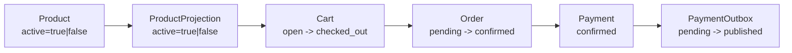
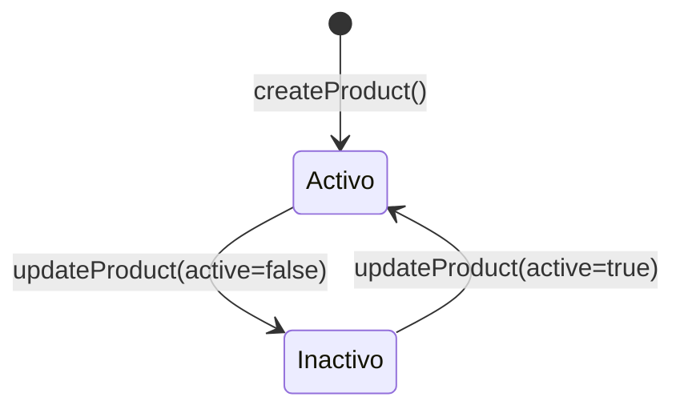
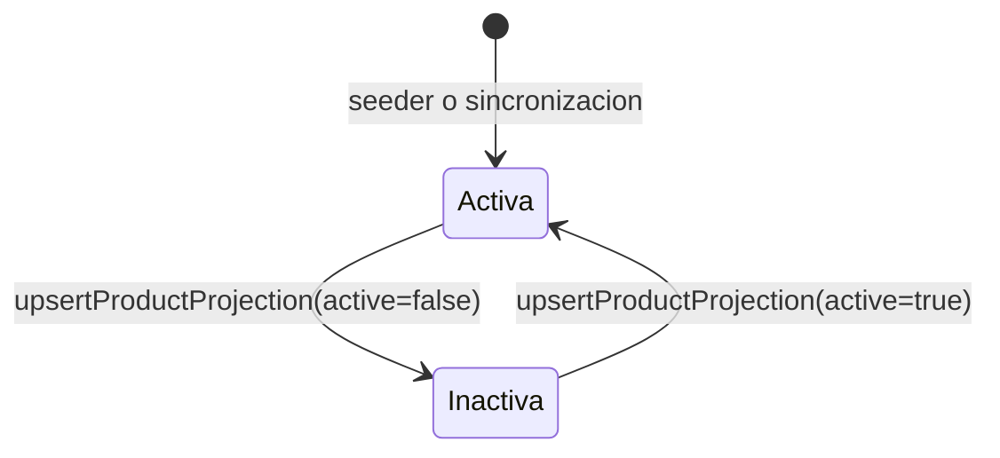
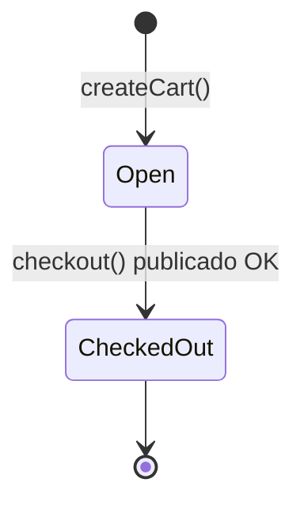
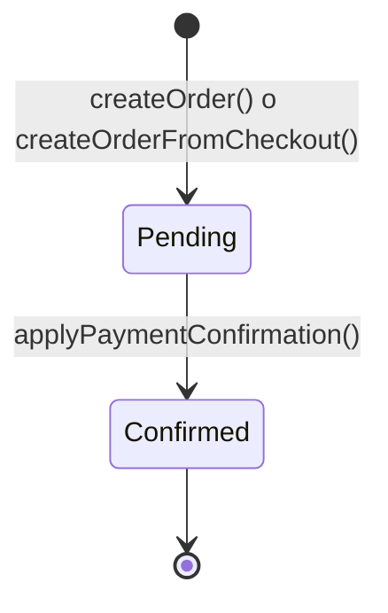
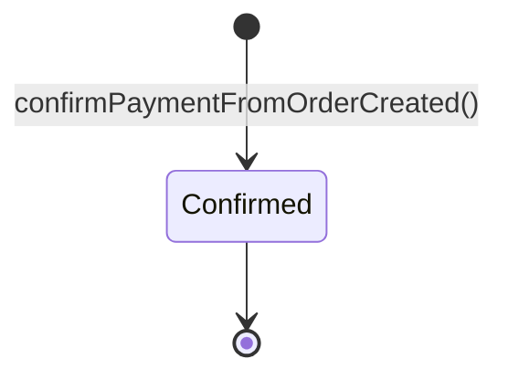
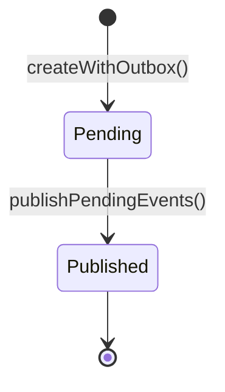
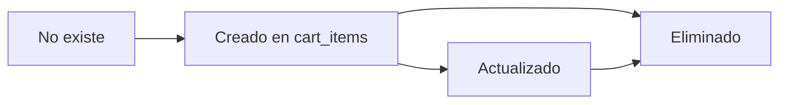
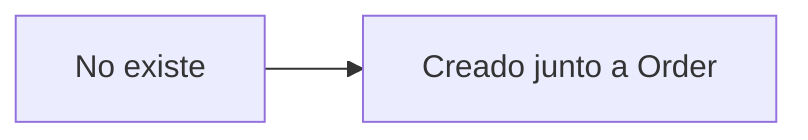

# Entity States

Este documento muestra solo los estados posibles de las entidades del sistema y como cambian.

## Resumen general

| Entidad | Campo de estado | Estados posibles |
| --- | --- | --- |
| `Product` | `active` | `true`, `false` |
| `ProductProjection` | `active` | `true`, `false` |
| `Cart` | `status` | `open`, `checked_out` |
| `Order` | `status` | `pending`, `confirmed` |
| `Payment` | `status` | `confirmed` |
| `PaymentOutbox` | `status` | `pending`, `published` |
| `CartItem` | sin estado propio | no aplica |
| `OrderItem` | sin estado propio | no aplica |

## Vista global

## Product

`Product` no usa un enum textual. Su estado se modela con el booleano `active`.

### Lectura rapida

- Todo producto nuevo nace `active=true`.
- Un producto inactivo sigue existiendo, pero no deberia agregarse al carrito.

## ProductProjection

`ProductProjection` replica el estado minimo que `cart` necesita del catalogo.

### Lectura rapida

- Su disponibilidad tambien depende del booleano `active`.
- `cart` valida esta proyeccion local antes de aceptar un item.

## Cart

### Lectura rapida

- `Cart` nace en `open`.
- Mientras esta `open`, se pueden agregar, editar y borrar items.
- Cuando `checkout()` publica `checkout.initiated`, pasa a `checked_out`.
- Si la publicacion falla, el servicio hace rollback tecnico y el carrito vuelve a `open`.

## Order

### Lectura rapida

- `Order` nace en `pending`.
- `orders` no persiste hoy un estado `failed`.
- Si la confirmacion falla por negocio, se emite el evento `order.confirmation_failed`, pero la orden sigue sin pasar a un nuevo estado persistido.

## Payment

### Lectura rapida

- Hoy `Payment` solo tiene un estado persistido: `confirmed`.
- La creacion del pago ocurre automaticamente al consumir `order.created`.
- La idempotencia evita duplicar pagos ante redelivery del mismo evento.

## PaymentOutbox

### Lectura rapida

- Cada evento saliente de `payments` entra primero en `pending`.
- Cuando el publisher lo envia a SNS correctamente, cambia a `published`.
- Si falla el envio, queda en `pending` y aumenta `attempts`.

## Entidades sin estado propio

### CartItem

`CartItem` no tiene un campo `status`. Solo existe o no existe dentro de un `Cart`.

### OrderItem

`OrderItem` tampoco tiene un campo `status`. Se crea como snapshot al momento de crear la orden.

## Notas importantes

- `order.confirmation_failed` es un evento de dominio, no un estado persistido de `Order`.
- `checkout.initiated`, `order.created` y `payment.confirmed` son eventos, no entidades.
- Si mas adelante quieres modelar cancelaciones, rechazos o expiraciones, ahi si tendria sentido ampliar los estados de `Cart`, `Order` y `Payment`.
