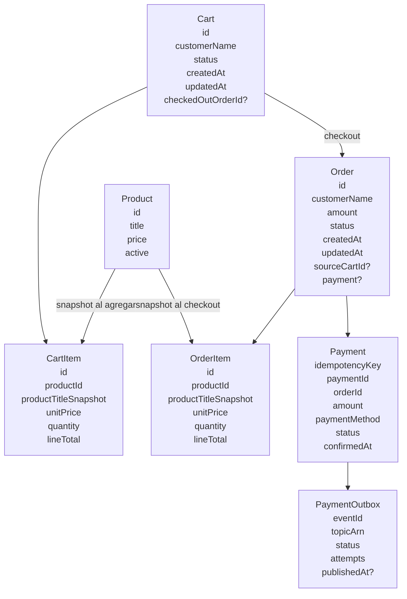
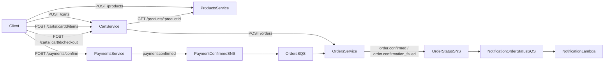
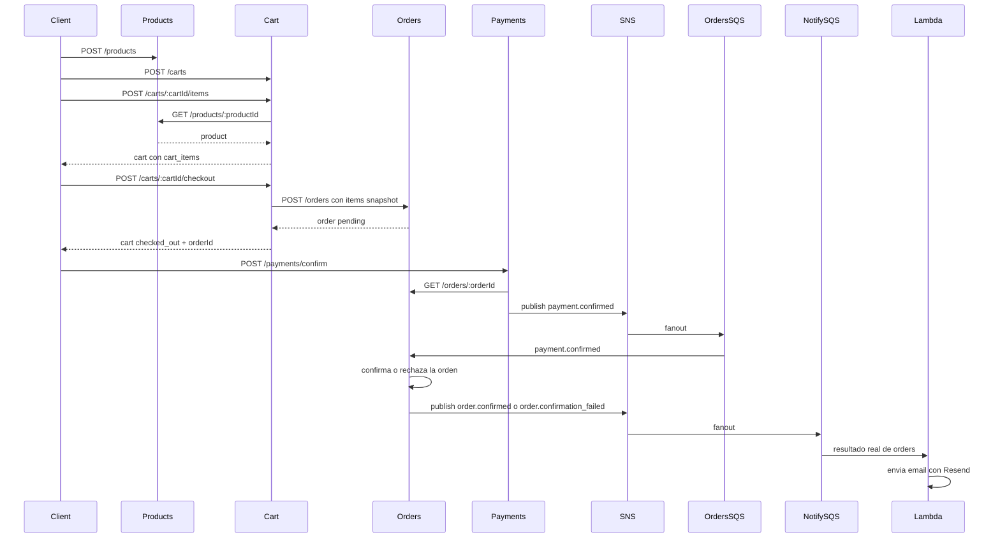

# Marketplace Simple Flow

## Cuando se crea cada cosa

### Carrito

El carrito se crea cuando el cliente llama:

```text
POST /carts
```

En ese momento `cart` persiste una entidad `Cart` con:

- `id`
- `customerName`
- `status = open`
- `createdAt`
- `updatedAt`

Todavia no existe ninguna orden.

### Cart items

Los items del carrito se crean cuando el cliente llama:

```text
POST /carts/:cartId/items
```

En ese momento:

1. `cart` consulta a `products` por HTTP para traer el producto.
2. valida que exista y que este activo.
3. guarda un snapshot en `cart_items` con:
   - `productId`
   - `productTitleSnapshot`
   - `unitPrice`
   - `quantity`
   - `lineTotal`

### Order

La orden se crea cuando el cliente llama:

```text
POST /carts/:cartId/checkout
```

En ese momento:

1. `cart` toma todos los `cart_items`.
2. arma un payload para `orders`.
3. llama por HTTP a:

```text
POST /orders
```

4. `orders` crea la entidad `Order` en estado `pending`.

### Order items

Los `order_items` se crean en el mismo momento que la orden, durante el checkout.

No se crean antes.

Secuencia:

1. el carrito ya tiene `cart_items`
2. `cart` manda esos items como snapshot a `orders`
3. `orders` inserta:
   - una fila en `orders`
   - una o varias filas en `order_items`

O sea:

- `cart_items` representan la compra en construccion
- `order_items` representan la compra ya cerrada

## Modelo de entidades



## Comunicacion entre servicios



## Flujo completo



## Resumen corto

- `Cart` nace primero.
- `CartItem` nace cuando agregas productos al carrito.
- `Order` y `OrderItem` nacen juntos en el checkout.
- `Payment` nace cuando confirmas el pago.
- `Order` publica el resultado final de confirmacion y desde ahi sale el email.
